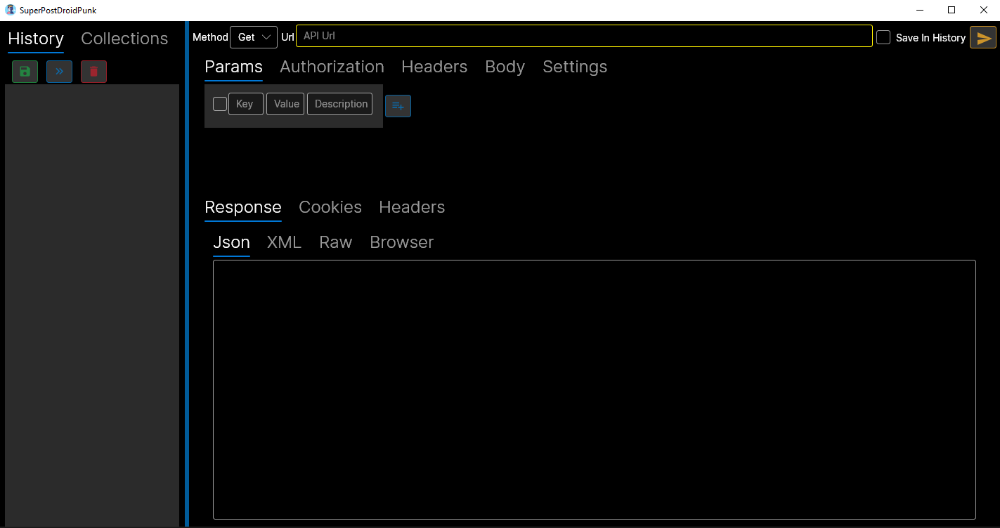
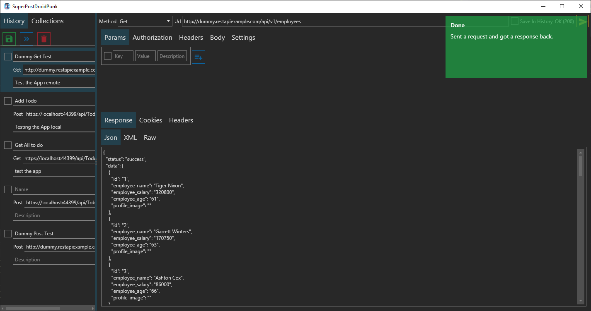
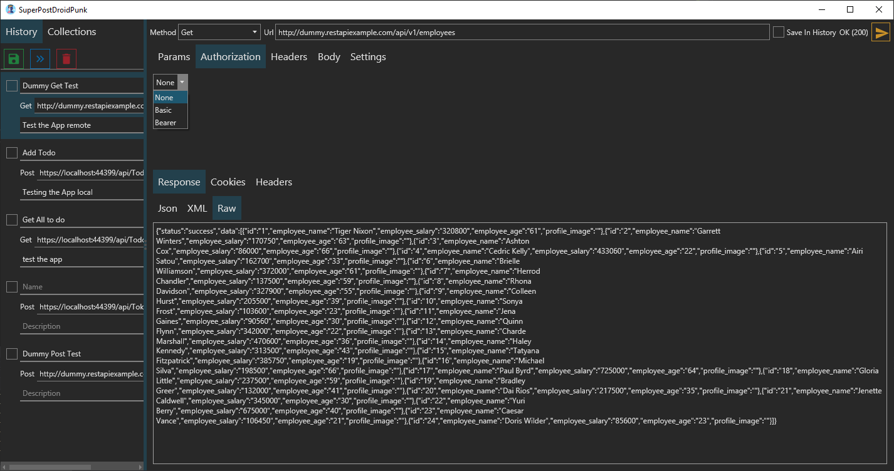
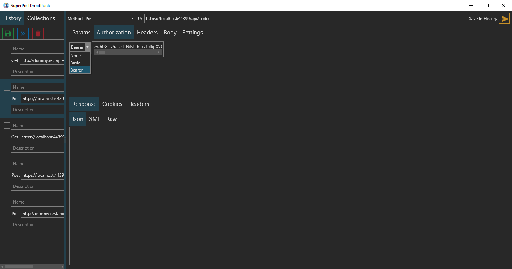
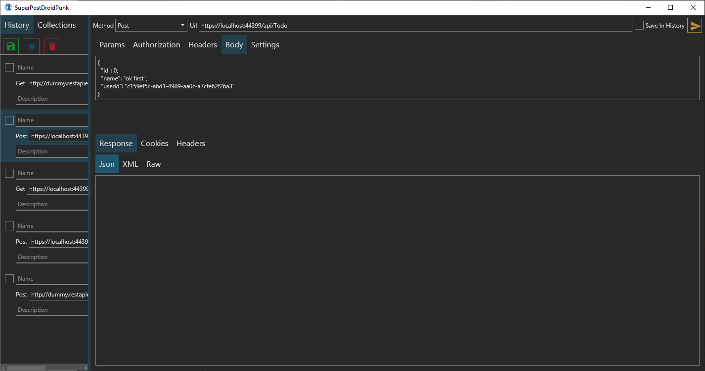

# SuperPostDroidPunk
is a Postman like app to send http requests written in c# with .Net Core 3.1 and AvaloniaUI that can run on Windows, Linux and Mac.

## Why that name?

I was going to name it PostDroid you know because the future is for machines but my friend pointed out that there is might be Superhumans, Cyborgs, Bots and AI so i smashed all of them together.

## The Application uses:
	1- LiteDB https://github.com/mbdavid/LiteDB
	2- Avalonia https://github.com/AvaloniaUI/Avalonia
	3- Flurl https://github.com/tmenier/Flurl
	4- Newtonsoft.Json https://github.com/JamesNK/Newtonsoft.Json

## Credits
the original Icons was made by Freepik https://www.flaticon.com/free-icon/postman_320339 and Flat Icons https://www.flaticon.com/free-icon/artificial-intelligence_2036901
  
## Screenshots

    

## Notes

Not all the features are working right now just the basics